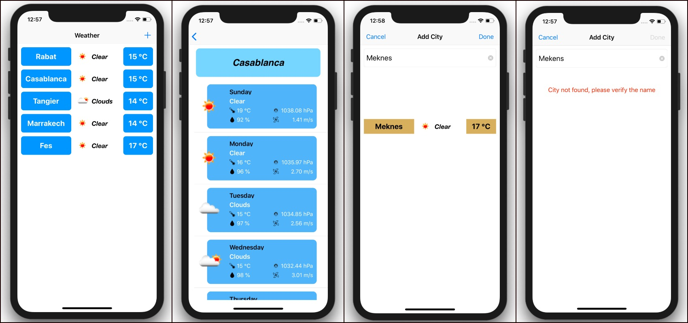

# Weather Forecast
Weather Forecast is a simple weather app, that show the current weather of 5 cities (Casablanca, Rabat, Marrakech, Tangier and Fes), also you can add city to the list.

When select a city, you can see a 5 day weather forecast.Also you can delete a city from the list.

# Screenshots


# Functionality

- The city list should default to Casablanca, Rabat, Marrakech, Tangier and Fes
- The layout of the list items should contains the city name, the temperature and the overall weather state(Sunny, Cloudy, Rainy... )
- When the user clicks on a city they must be redirected to detail page showing temperature, humidity wind speed, and pressure . Theusermustbeabletoaddacitytothelist.
- The user must be able to remove a city from the city
list.
- The user must be able to refresh the weather forecast .

## How to build

1) Clone the repository

```bash
$ git clone https://github.com/medHajajate/Weather-Forecast.git
```

2) Install pods

```bash
$ cd Weather\ Forecast/
$ pod install
```

3) Open the workspace in Xcode

```bash
$ open "Weather-Forecast.xcworkspace"
```

4) Sign up on [openweathermap.org/appid](http://openweathermap.org/appid) to get an appid or user my appId

```bash
$ Go to APIManager class, and change the "apiKey"
```
 
5) Compile and run the app in your simulator

# Requirements

* Xcode 10
* iOS 11+
* Swift 4

# Libraries

* [Alamofire](https://github.com/Alamofire/Alamofire5)
* [SDWebImage](https://github.com/SDWebImage/SDWebImage)
